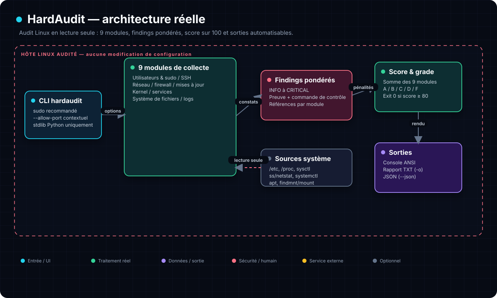

# ☠️ HardAudit — Audit de sécu Linux qui fait mal

```
██╗  ██╗ █████╗ ██████╗ ██████╗  █████╗ ██╗   ██╗██████╗ ██╗████████╗
██║  ██║██╔══██╗██╔══██╗██╔══██╗██╔══██╗██║   ██║██╔══██╗██║╚══██╔══╝
███████║███████║██████╔╝██║  ██║███████║██║   ██║██║  ██║██║   ██║
██╔══██║██╔══██║██╔══██╗██║  ██║██╔══██║██║   ██║██║  ██║██║   ██║
██║  ██║██║  ██║██║  ██║██████╔╝██║  ██║╚██████╔╝██████╔╝██║   ██║
╚═╝  ╚═╝╚═╝  ╚═╝╚═╝  ╚═╝╚═════╝ ╚═╝  ╚═╝ ╚═════╝ ╚═════╝ ╚═╝   ╚═╝
```

> **Un script. 9 modules. Un score sur 100. Des actions concrètes. Zéro bullshit.**

[](https://python.org)
[](LICENSE)
[](hardaudit.py)
[](https://www.cisecurity.org/benchmark/debian_linux)

---

## 🤔 Le problème

T'as 50 VMs Linux à auditer. T'as pas le temps de passer 2h sur chaque. Les outils existants (Lynis, OpenSCAP) sont lourds, verbeux, et te crachent 500 lignes que personne ne lit.

Toi, tu veux :
- Un **score** rapide pour savoir si c'est la cata ou pas
- Les **actions prioritaires** pour corriger
- Un **rapport** que tu peux filer au client
- Quelque chose qui tourne **sans rien installer**

---

## 💡 La solution

**HardAudit** — un fichier Python, zéro dépendance. Tu le balances sur n'importe quelle VM Linux et il te dit ce qui pue.

```bash
sudo python3 hardaudit.py
```

```
╔══════════════════════════════════════════╗
║  SCORE FINAL : 41/100 — 41% — GRADE D  ║
╚══════════════════════════════════════════╝

  █████████░ Reseau & Ports             11/12 ✓
  ██████████ Firewall                   12/12 ✓
  █████░░░░░ Mises a jour               5/10  ⚠1
  ░░░░░░░░░░ SSH                         0/12  ⚠3
  ░░░░░░░░░░ Systeme de fichiers         0/10  ⚠2

  ACTIONS PRIORITAIRES :
  ☠ /etc/shadow lisible
  ▲ PermitRootLogin = yes
  ▲ Aucun firewall actif
```

---

## ⚡ Installation

```bash
curl -fsSL https://raw.githubusercontent.com/Yukouf/hardaudit/main/hardaudit.py \
  | sudo tee /usr/local/bin/hardaudit >/dev/null \
  && sudo chmod +x /usr/local/bin/hardaudit
```

Puis lance l'audit depuis n'importe quel dossier :

```bash
sudo hardaudit
```

## 🏗️ Architecture



HardAudit lit la configuration et l’état du système sans les modifier. Ses neuf modules produisent des constats pondérés, regroupés en un score sur 100, un grade et des sorties console, TXT ou JSON. Un score inférieur à 80 provoque un code de sortie non nul pour l’automatisation.

Exporter un rapport ou obtenir du JSON :

```bash
sudo hardaudit -o rapport.txt
sudo hardaudit --json
```

Adapter le score au contexte métier sans masquer les preuves :

```bash
sudo hardaudit --allow-port 3306 --allow-port 10050
```

Les ports déclarés restent visibles en `INFO` dans le terminal, le TXT et le JSON, mais ne réduisent plus le score. N'utilise cette option qu'après avoir identifié le processus et validé que l'écoute est intentionnelle.

Désinstaller :

```bash
sudo rm /usr/local/bin/hardaudit
```

Pas de `pip install`, de virtualenv ou de Docker : **Python 3.8+ suffit.**

---

## 🧠 Les 9 modules d'audit

| Module | Points | Référence | Ce qu'il vérifie |
|---|---|---|---|
| Utilisateurs | 12 | CIS 5.x | Root accessible, UID 0 non-root, sudo sans mdp, umask |
| SSH | 12 | CIS 5.2 / ANSSI R5 | PermitRootLogin, PasswordAuth, X11Forwarding, port |
| Réseau | 12 | CIS 3.x | Écoutes wildcard, validation anti-spoofing (`rp_filter`), refus des routes IPv4 imposées par la source, en-têtes de routage IPv6 type 2, journalisation des sources impossibles, routage inhabituel de `127/8`, refus des paquets usurpant une adresse IPv4 locale, redirects ICMP IPv4/IPv6, routeurs acceptant encore les annonces IPv6 (`accept_ra=2`), RA dont la source appartient déjà à l'hôte, protection TCP TIME-WAIT contre les RST et refus des requêtes ICMP broadcast/multicast |
| Firewall | 12 | CIS 3.5 | UFW/nftables/iptables et politique entrante effective deny/drop |
| Mises à jour | 10 | CIS 1.8 / ANSSI R3 | Paquets à mettre à jour, unattended-upgrades |
| Kernel | 14 | CIS 1.6 / ANSSI R14 | ASLR, entropie mmap et décalage aléatoire de la pile kernel à chaque syscall, ptrace, perf_events, syncookies, pile LSM et présence d'une politique MAC, BPF non privilégié et durcissement du JIT BPF, core dumps privilégiés, collecteurs pipe sans borne et chemin du helper root, répétition illimitée des oops kernel, io_uring globalement ouvert et sans médiation AppArmor sur les kernels compatibles, userfaultfd non restreint par sysctl **ou délégué via `/dev/userfaultfd`**, memfd exécutables par défaut, namespaces utilisateur sans médiation AppArmor et exception des profils `unconfined`, page mémoire nulle, autoload TTY et injection TIOCSTI historique, verrou kexec et limites de chargement des images normales/de crash, modules/Lockdown, interprètes `binfmt_misc` héritant des privilèges du binaire, masquage des pointeurs kernel (modes renforcés acceptés), protections hardlink/symlink/FIFO/fichiers de `/tmp` |
| Services | 10 | CIS 2.x | Services obsolètes, cron jobs, binaires et bibliothèques supprimés encore exécutables en mémoire |
| Filesystem | 10 | CIS 1.1 / ANSSI R28 | `/tmp` exécutable, cloisonnement `nodev,nosuid,noexec` de `/dev/shm`, world-writable, sticky bit, shadow, visibilité inter-utilisateurs de `/proc` |
| Logs | 8 | CIS 4.x | auditd, rsyslog, logrotate |

---

## 📊 Scoring

```
Score    Grade   Interprétation
─────────────────────────────────
90-100   A       Excellent — machine bien sécurisée
75-89    B       Bon — quelques améliorations mineures
60-74    C       Plusieurs contrôles à examiner
40-59    D       Durcissement nettement incomplet
0-39     F       Nombreux contrôles non satisfaits — analyse manuelle indispensable
```

Chaque finding a une sévérité :

| Sévérité | Pénalité | Icône |
|---|---|---|
| LOW | -1 | `i` |
| MEDIUM | -3 | `⚠` |
| HIGH | -5 | `▲` |
| CRITICAL | -10 | `☠` |

---

## 🔎 Vérifier les résultats

Chaque résultat sensible affiche désormais une ligne **`Verifier :`** avec la commande système indépendante qui permet de contrôler le fait observé. HardAudit ne doit donc pas être cru sur parole.

Exemples :

```bash
# Permissions et propriétaire réels de /etc/shadow
sudo stat -c '%a %U %G %n' /etc/shadow

# Configuration SSH réellement appliquée (valeurs par défaut + Include)
sudo sshd -T | grep -E '^(permitrootlogin|passwordauthentication|x11forwarding|maxauthtries|clientaliveinterval) '

# Programme associé à un port
sudo ss -ltnp

# Validation de l'adresse source IPv4 (0 = absente, 1 = stricte, 2 = souple)
sysctl net.ipv4.conf.all.rp_filter net.ipv4.conf.default.rp_filter
grep -H . /proc/sys/net/ipv4/conf/*/rp_filter

# Routes IPv4 proposées par le paquet : global ET interface doivent valoir 1 pour accepter
grep -H . /proc/sys/net/ipv4/conf/{all,default,*}/accept_source_route 2>/dev/null

# Routage IPv6 : toute valeur négative refuse les en-têtes ; 0 accepte encore le type 2
grep -H . /proc/sys/net/ipv6/conf/{all,default,*}/accept_source_route 2>/dev/null

# Paquets aux adresses source impossibles : "all=1" OU la valeur locale active le journal
grep -H . /proc/sys/net/ipv4/conf/{all,default,*}/log_martians 2>/dev/null
journalctl -k | grep -i martian

# Routage des adresses loopback 127/8 hors de l'hôte (1 = autorisé)
grep -H . /proc/sys/net/ipv4/conf/{all,default,*}/route_localnet 2>/dev/null
sudo nft list ruleset

# Paquets reçus avec une adresse source locale : "all=1" OU la valeur locale les accepte
grep -H . /proc/sys/net/ipv4/conf/{all,default,*}/accept_local 2>/dev/null
ip route show table all

# Redirects ICMP IPv4 : la règle effective dépend aussi du mode hôte/routeur de chaque interface
grep -H . /proc/sys/net/ipv4/conf/{all,default,*/}{accept_redirects,forwarding} 2>/dev/null

# Émission de redirects : sur une interface routeur, `all=1` OU la valeur locale suffit
grep -H . /proc/sys/net/ipv4/conf/{all,default,*/}{send_redirects,forwarding} 2>/dev/null

# Redirects ICMPv6 : actifs sur une interface hôte si accept_redirects=1 et forwarding=0
grep -H . /proc/sys/net/ipv6/conf/{default,*/}{accept_redirects,forwarding} 2>/dev/null

# Annonces de routeur IPv6 : accept_ra=2 outrepasse le forwarding actif
grep -H . /proc/sys/net/ipv6/conf/{default,*/}{accept_ra,forwarding} 2>/dev/null

# RA portant une adresse source déjà locale (0 = refus anti-boucle, 1 = acceptation)
grep -H . /proc/sys/net/ipv6/conf/{default,*/}{accept_ra,accept_ra_from_local,forwarding} 2>/dev/null

# Protection RFC 1337 : 1 empêche un RST de supprimer prématurément l'état TCP TIME-WAIT
sysctl net.ipv4.tcp_rfc1337

# Requêtes ICMP ECHO/TIMESTAMP broadcast ou multicast : 1 = ignorées
sysctl net.ipv4.icmp_echo_ignore_broadcasts

# Processus utilisant encore un ancien binaire après mise à jour
sudo ls -l /proc/PID/exe
sudo ps -fp PID

# Bibliothèques/fichiers supprimés encore chargés avec le droit d'exécution
sudo grep -F ' (deleted)' /proc/PID/maps
# Une mise à jour légitime est fréquente ; un chemin /tmp, /var/tmp ou /dev/shm mérite une analyse rapide

# Protections contre les fichiers et liens piégés dans les dossiers partagés
sysctl fs.protected_hardlinks fs.protected_symlinks fs.protected_fifos fs.protected_regular
# Pour protected_fifos/regular : 1 couvre les dossiers sticky publics, 2 inclut ceux partagés par groupe

# Visibilité des processus entre comptes locaux (hidepid=0 par défaut, 1/2/4 restreints)
findmnt /proc -o TARGET,FSTYPE,OPTIONS
runuser -u nobody -- test -r /proc/1/status

# Mémoire partagée POSIX : vérifier nodev,nosuid,noexec
findmnt -T /dev/shm -o TARGET,FSTYPE,OPTIONS

# Core dumps privilégiés : 0 = désactivés ; 1 = dangereux ; 2 = sûr seulement avec pipe ou chemin absolu
sysctl fs.suid_dumpable kernel.core_pattern

# Si core_pattern commence par |, 0 autorise des collecteurs simultanés sans limite
sysctl kernel.core_pattern kernel.core_pipe_limit
ulimit -c

# Un helper pipe tourne avec les credentials root : tout son chemin doit être maîtrisé par root
namei -l $(sysctl -n kernel.core_pattern | sed -n 's/^|[[:space:]]*\([^[:space:]]*\).*/\1/p')

# Oops kernel : oops_limit=0 désactive le compteur ; une valeur positive borne les répétitions
sysctl kernel.panic_on_oops kernel.oops_limit

# Magic SysRq : masque 64 = signaux aux processus, 128 = redémarrage/extinction
# Exemple 176 (0xb0) autorise sync + remontage lecture seule + redémarrage
sysctl kernel.sysrq
stat -c '%A %U %G %n' /proc/sysrq-trigger

# Quotas mémoire des pipes par utilisateur (0/0 = aucune limite par UID)
sysctl fs.pipe-user-pages-soft fs.pipe-user-pages-hard
getconf PAGE_SIZE

# Masquage des pointeurs kernel (0 = exposés, 1 = restreints, 2 = masqués même pour root)
sysctl kernel.kptr_restrict

# Accès au syscall BPF par les utilisateurs non privilégiés (0 = autorisé, 1/2 = bloqué)
sysctl kernel.unprivileged_bpf_disabled

# Durcissement anti-JIT-spraying de BPF (0 = absent, 1 = non privilégiés, 2 = tous)
sysctl net.core.bpf_jit_harden

# Profilage perf (valeur minimale 2 : aucun événement kernel sans privilège)
sysctl kernel.perf_event_paranoid

# Création d'instances io_uring (0 = tous, 1 = groupe dédié, 2 = désactivée)
sysctl kernel.io_uring_disabled

# Sur les kernels compatibles : médiation AppArmor de io_uring pour les comptes non privilégiés
[ ! -e /proc/sys/kernel/apparmor_restrict_unprivileged_io_uring ] || \
  sysctl kernel.apparmor_restrict_unprivileged_io_uring

# Interception userfaultfd des fautes kernel (0 = CAP_SYS_PTRACE requis, 1 = non restreint)
sysctl vm.unprivileged_userfaultfd
[ ! -e /dev/userfaultfd ] || stat -c '%A %U %G %n' /dev/userfaultfd
[ ! -e /dev/userfaultfd ] || { command -v getfacl >/dev/null && getfacl -cp /dev/userfaultfd; }

# Exécution depuis un fichier anonyme memfd (0 = implicite, 1 = explicite, 2 = refusée)
sysctl vm.memfd_noexec

# Sur les kernels Ubuntu compatibles : médiation userns générale et profils AppArmor unconfined
sysctl kernel.unprivileged_userns_clone kernel.apparmor_restrict_unprivileged_userns \
  kernel.apparmor_restrict_unprivileged_unconfined
runuser -u nobody -- unshare --user --map-root-user true

# Plancher des projections mémoire (0 = page nulle accessible, 65536 = valeur courante)
sysctl vm.mmap_min_addr

# Entropie mmap effective et maxima réellement compilés pour ce kernel
sysctl vm.mmap_rnd_bits vm.mmap_rnd_compat_bits
grep -E '^CONFIG_ARCH_MMAP_RND_(COMPAT_)?BITS_MAX=' /boot/config-$(uname -r)

# Environ 5 bits supplémentaires de décalage de pile à chaque entrée syscall
grep '^CONFIG_RANDOMIZE_KSTACK_OFFSET' /boot/config-$(uname -r)
grep -o 'randomize_kstack_offset=[^ ]*' /proc/cmdline

# Autoload des disciplines TTY (0 = réservé à CAP_SYS_MODULE, 1 = non privilégié)
sysctl dev.tty.ldisc_autoload

# Injection de frappes TIOCSTI (0 = réservé à CAP_SYS_ADMIN, 1 = comportement historique)
sysctl dev.tty.legacy_tiocsti

# Verrou kexec (1 = aucun nouveau kernel chargeable, irréversible jusqu'au redémarrage)
sysctl kernel.kexec_load_disabled

# Compteurs kexec : -1 = chargements illimités ; une valeur positive décroît à chaque chargement
sysctl kernel.kexec_load_limit_reboot kernel.kexec_load_limit_panic

# Verrou des modules (1 = ni chargement ni retrait, irréversible jusqu'au redémarrage)
sysctl kernel.modules_disabled
lsmod

# Kernel Lockdown ([none] = inactif ; integrity/confidentiality = actifs)
cat /sys/kernel/security/lockdown
cat /proc/cmdline

# Pile de modules de sécurité réellement active (plusieurs peuvent coexister)
cat /sys/kernel/security/lsm

# Interprètes binfmt_misc : le drapeau C transmet les droits du binaire à l'interprète
grep -H -E '^(enabled|interpreter |flags:)' /proc/sys/fs/binfmt_misc/* 2>/dev/null
```

> **Important :** le score est un indicateur de triage, pas une certification CIS/ANSSI. Un finding prouve une configuration observée, pas automatiquement une compromission. Le contexte de la machine reste indispensable.

> **Faux positif kexec :** conserver `kernel.kexec_load_disabled=0` est légitime sur un hôte utilisant `kexec` ou `kdump`. Les limites `kexec_load_limit_reboot` et `kexec_load_limit_panic` permettent alors de borner séparément les chargements normaux et de crash, mais ne peuvent être rendues que plus restrictives ; dimensionner les valeurs selon les redémarrages et crash dumps attendus. Ne jamais passer le verrou global à `1` avant d'avoir vérifié ces usages : il ne peut plus être annulé avant un redémarrage.

> **Faux positif modules :** conserver `kernel.modules_disabled=0` est normal sur une machine qui utilise le hotplug, DKMS ou charge encore des pilotes après le démarrage. La valeur `1` vise surtout les appliances stables ; elle bloque aussi le retrait des modules et ne peut plus être annulée avant un redémarrage.

> **Faux positif Lockdown :** le mode `none` est courant sur une VM sans Secure Boot et n'indique pas une compromission. `integrity` ou `confidentiality` est surtout pertinent pour une chaîne de démarrage maîtrisée ; tester auparavant les modules, kexec et outils de diagnostic qui peuvent être bloqués.

> **Faux positif LSM/MAC :** `capability`, Yama, Lockdown et Landlock peuvent être actifs sans fournir une politique MAC globale. HardAudit exige donc AppArmor, SELinux, Smack ou TOMOYO dans la pile, mais leur simple présence ne prouve pas que les profils sont complets ni en mode bloquant ; ce contrôle vérifie la fondation, pas la qualité de toute la politique.

> **Faux positif userns :** navigateurs, sandbox et outils de conteneurs peuvent dépendre des namespaces utilisateur. HardAudit ne signale ce point que si le kernel expose la médiation AppArmor dédiée, que `unprivileged_userns_clone=1` et que cette médiation vaut `0` ; tester les profils applicatifs avant de l'activer.

> **Faux positif profils AppArmor unconfined :** la valeur `0` peut être volontaire lorsqu'un profil marqué `unconfined` doit créer des namespaces utilisateur. HardAudit ne la signale que si userns et sa médiation générale sont tous deux actifs ; examiner les profils concernés avant de passer ce verrou à `1`.

> **Faux positif entropie ASLR :** augmenter `mmap_rnd_bits` élargit l'espace réservé à la randomisation et peut gêner une application qui consomme un espace d'adressage virtuel exceptionnellement grand. HardAudit compare au maximum de l'architecture compilé dans le kernel, mais recommande un test applicatif avant de rendre la valeur persistante.

> **Faux positif pile kernel :** ce décalage ajoute environ 5 bits d'entropie indépendamment de l'ASLR classique, avec un faible coût à chaque syscall. HardAudit ne conclut que si le support est compilé et que le défaut ou le paramètre de démarrage le désactive ; l'absence du fichier de configuration est traitée comme inconnue.

> **Faux positif /dev/shm :** certains logiciels créent puis exécutent directement du code dans `/dev/shm`. `noexec` peut les casser et n'empêche pas un interpréteur de lire un script ; c'est une réduction de surface, pas une frontière absolue. Tester avant de rendre l'option persistante.

> **Faux positif JIT BPF :** le mode `2` durcit aussi les programmes chargés par des processus privilégiés mais peut coûter en performances. Le mode `1` peut être un compromis acceptable, surtout si le BPF non privilégié est déjà bloqué ; le finding reste donc `LOW` et doit être arbitré selon les usages réseau et observabilité.

> **Faux positif io_uring :** navigateurs, bases de données et runtimes peuvent dépendre de io_uring. Sur les kernels qui exposent `apparmor_restrict_unprivileged_io_uring`, HardAudit indique si cette médiation de repli est inactive sans ajouter une seconde pénalité ; tester les profils AppArmor avant activation.

> **Faux positif `/dev/userfaultfd` :** déléguer ce périphérique à un groupe précis peut être volontaire pour un hyperviseur ou un gestionnaire mémoire. Cette permission contourne néanmoins `vm.unprivileged_userfaultfd=0` par conception ; vérifier les membres du groupe et les ACL avant de la conserver. Le contrôle des bits Unix ne remplace pas l'examen de `getfacl` lorsqu'une ACL étendue existe.

> **Faux positif core dumps SUID :** `fs.suid_dumpable=2` n'est pas automatiquement dangereux. Le kernel l'autorise avec un `core_pattern` dirigé vers un handler (`|...`) ou un chemin absolu ; HardAudit vérifie désormais les deux valeurs ensemble. Le mode `1`, lui, reste réservé au débogage car il permet aux utilisateurs ordinaires d'examiner la mémoire de processus privilégiés.

> **Faux positif core_pipe_limit :** une valeur `0` n'est signalée que si `core_pattern` lance réellement un helper avec `|`. Une borne positive limite le nombre de collecteurs concurrents mais peut faire sauter des dumps lors d'une vague de crash ; dimensionner selon la capacité et les besoins de diagnostic.

> **Faux positif helper de core dump :** HardAudit suit les liens symboliques et vérifie chaque composant du chemin résolu. Un répertoire ou exécutable non possédé par root, ou inscriptible par groupe/autres, est critique car le kernel lance le helper avec les credentials root dans les namespaces initiaux. Une délégation volontaire doit éviter toute modification de ce chemin privilégié.

> **Faux positif oops_limit :** `panic_on_oops=1` arrête immédiatement la machine au premier oops, ce qui peut transformer un bug en indisponibilité. HardAudit ne l'exige pas : il signale uniquement le couple `panic_on_oops=0` et `oops_limit=0`, qui désactive toute borne liée au nombre d'oops. Une valeur positive conserve une marge de diagnostic tout en limitant les répétitions.

> **Faux positif Magic SysRq :** le redémarrage d'urgence peut être volontaire sur une machine disposant d'une console physique ou distante maîtrisée. HardAudit ne signale que les bits destructeurs `64` (signaux) et `128` (redémarrage/extinction), pas les fonctions de récupération sync/remontage. Le sysctl limite les frappes clavier mais ne bloque pas `/proc/sysrq-trigger` pour un administrateur ; retirer les bits uniquement après validation des procédures de secours.

> **Faux positif quotas de pipes :** `pipe-user-pages-hard=0` seul est la valeur par défaut et ne signifie pas forcément « illimité en pratique » : une borne souple positive réduit déjà les nouveaux pipes après dépassement. HardAudit ne signale que le couple `soft=0, hard=0`. Dimensionner ces quotas selon le nombre de workers et la mémoire disponible ; une valeur trop basse peut casser des charges légitimes.

> **Faux positif fichiers temporaires :** `protected_fifos=1` et `protected_regular=1` protègent déjà les dossiers sticky accessibles à tous, mais pas ceux inscriptibles par un groupe. HardAudit recommande `2` pour couvrir aussi ce cas ; conserver `1` peut être volontaire si des applications d'un groupe partagé doivent rouvrir avec `O_CREAT` des objets qu'elles ne possèdent pas.

> **Faux positif rp_filter :** le mode strict `1` peut casser le routage asymétrique ou certains montages multi-interface. Le mode souple `2` vérifie que la source est joignable par une interface et constitue alors le compromis documenté par le kernel ; HardAudit accepte les deux et tient compte du maximum entre `conf/all` et chaque interface.

> **Faux positif source routing IPv4 :** ce mécanisme historique peut subsister dans un laboratoire réseau ou un équipement de test. HardAudit ne le signale que si `conf/all=1` **et** l'interface vaut `1`, condition effective documentée par le kernel ; la valeur `default=1` seule ne rend pas les interfaces existantes vulnérables.

> **Faux positif routage IPv6 :** la valeur par défaut `0` refuse les types inconnus mais accepte encore l'en-tête type 2 prévu pour Mobile IPv6. HardAudit le signale en `MEDIUM` lorsque la politique globale et locale sont toutes deux non négatives ; conserver ce mode seulement si Mobile IPv6 est réellement utilisé.

> **Faux positif log_martians :** ce réglage améliore la visibilité mais ne remplace ni `rp_filter` ni un firewall. Sur un réseau bruité ou volontairement asymétrique, il peut remplir les journaux ; dimensionner la rotation et corriger les routes légitimes avant de l'activer partout.

> **Faux positif route_localnet :** les proxies transparents et certaines publications de ports conteneurisés utilisent volontairement le routage de `127/8`. La valeur `all=1` **ou** celle d'une interface à `1` suffit ; vérifier les règles NAT avant de désactiver ce mode. Le finding signale que la barrière loopback est retirée, pas qu'un service est déjà exposé.

> **Faux positif accept_local :** certains routeurs asymétriques font sortir un paquet par une interface puis le réinjectent par une autre avec une adresse source locale. Linux accepte ce trafic si `conf/all/accept_local=1` **ou** si l'interface le permet ; HardAudit le signale car ce réglage retire un contrôle anti-usurpation, mais il peut être volontaire dans une topologie documentée.

> **Faux positif redirects ICMP :** un routeur administré peut utiliser volontairement les redirects. HardAudit calcule la règle documentée par le kernel par interface : en mode hôte, `all=1` **ou** `interface=1` suffit ; avec le forwarding actif, les deux doivent valoir `1`. Le finding prouve l'acceptation locale, pas une attaque en cours.

> **Faux positif émission de redirects :** HardAudit ne signale que les interfaces qui routent réellement et dont `send_redirects` est effectif (`all=1` **ou** `interface=1`). Un routeur administré peut en avoir besoin ; le finding `LOW` indique une capacité active, pas un détournement en cours.

> **Faux positif redirects ICMPv6 :** l'acceptation est le comportement hôte Linux par défaut et peut être nécessaire sur un réseau administré. HardAudit signale les interfaces concernées, y compris virtuelles, car une valeur globale à `0` ne neutralise pas leurs valeurs locales. Le finding prouve une capacité active, pas une attaque en cours.

> **Faux positif Router Advertisement :** `accept_ra=2` est volontaire sur certains routeurs qui doivent apprendre leur route amont par IPv6 tout en transférant les paquets. HardAudit ne signale que ce couple avec `forwarding=1` ; valider l'architecture avant de revenir à `0` ou `1`.

> **Faux positif RA à source locale :** `accept_ra_from_local=1` peut être requis par un laboratoire ou un montage réseau volontairement bouclé. HardAudit ne le signale que si l'interface accepte fonctionnellement les RA ; la valeur `1` prouve une exception anti-boucle, pas une attaque. Vérifier la topologie avant de la désactiver.

> **Faux positif TCP RFC 1337 :** le mode `1` ignore les RST reçus en état TIME-WAIT afin que les anciens segments expirent, mais s'écarte du comportement Linux historique par défaut. Le finding `LOW` signale une réduction de robustesse lors de la réutilisation rapide des mêmes adresses et ports, pas une attaque active.

> **Faux positif ICMP broadcast :** la valeur `0` peut servir à un diagnostic réseau ancien, mais fait répondre Linux aux requêtes ECHO et TIMESTAMP broadcast/multicast. Le finding signale une capacité d'amplification sur le segment local ; les routeurs modernes bloquent généralement les broadcasts dirigés, sans protéger pour autant un réseau local malveillant.

> **Faux positif memfd :** des runtimes, navigateurs ou moteurs JIT peuvent légitimement exécuter du code depuis un memfd. Le mode `1` conserve cette possibilité avec `MFD_EXEC` explicite ; le mode `2` la bloque et doit être testé avec les applications avant déploiement.

> **Faux positif hidepid :** ce durcissement apporte peu sur une machine réellement mono-utilisateur et peut gêner certains agents de supervision. Sur un serveur partagé, `hidepid=1` protège déjà les fichiers sensibles des processus ; `hidepid=2` masque aussi leurs répertoires. Tester le monitoring avant de modifier le montage de `/proc`.

> **Faux positif TIOCSTI :** certains logiciels historiques de terminal peuvent encore dépendre de cette injection. La valeur `0` convient à la plupart des systèmes modernes, mais les processus ayant `CAP_SYS_ADMIN` restent autorisés ; valider les outils d'accessibilité et de terminal avant déploiement global.

> **Faux positif binfmt_misc :** le drapeau `C` peut être intentionnel pour préserver les identifiants d'un binaire émulé. Il implique toutefois `O` et permet à l'interprète de tourner en root si le binaire correspondant est setuid root. Vérifier l'origine, les droits et la surface d'entrée de l'interprète avant de conserver ce mode.

---

## 🎬 Ce que ça donne en vrai

```bash
$ sudo python3 hardaudit.py
```

```
  [2/12] Utilisateurs & Authentification  CIS 5.x
  ▲ [HIGH    ] Root login actif
     Shell root = /bin/bash. Désactiver le login root direct.
  ▲ [HIGH    ] Sudo sans mot de passe
     NOPASSWD:ALL actif — toute commande sans authentification.

  [0/12] SSH  CIS 5.2 / ANSSI R5
  ▲ [HIGH    ] PermitRootLogin = yes
     Désactiver PermitRootLogin.
  ⚠ [MEDIUM  ] PasswordAuthentication non défini
     Utiliser uniquement des clés SSH.

  [12/12] Firewall  CIS 3.5
  ✓ Aucune anomalie détectée

  [7/14] Kernel & Protections  CIS 1.6 / ANSSI R14
  ⚠ [MEDIUM  ] IP forwarding actif
     /proc/sys/net/ipv4/ip_forward = 1 (attendu: 0)

  [0/10] Système de fichiers  CIS 1.1 / ANSSI R28
  ☠ [CRITICAL] /etc/shadow lisible
     Permissions trop larges sur /etc/shadow.
```

---

## 📁 Structure

```
hardaudit/
├── hardaudit.py      # Le script — tout tient dans un seul fichier
├── test_hardaudit.py # Tests sans dépendance externe
├── assets/architecture.svg # Schéma d’architecture vectoriel
├── LICENSE           # MIT
└── README.md         # Ce fichier
```

---

## 🔧 Comparaison avec les alternatives

| Outil | Dépendances | Poids | Style | Export |
|---|---|---|---|---|
| **HardAudit** | **0** | **25 Ko** | **Score/100 + couleurs** | **TXT** |
| Lynis | Shell + 300 fichiers | 3 Mo | Logs verbeux | HTML/TXT |
| OpenSCAP | XML + XSLT + 50 paquets | 50 Mo+ | XML imbuvable | HTML |
| CIS-CAT | Java | 200 Mo+ | Rapports PDF | PDF |

HardAudit, c'est l'outil que tu balances en 2 secondes sur une VM pour avoir un premier avis. Pas l'audit de certification ANSSI — pour ça, Lynis ou OpenSCAP.

---

## 🔬 Comparaison avec les références

La comparaison documentée avec Lynis, OpenSCAP, CIS-CAT, Tiger, osquery et Wazuh SCA est disponible dans [`COMPARAISON_REFERENCES.md`](COMPARAISON_REFERENCES.md). HardAudit reprend des **concepts génériques** — profils, statuts par règle, preuves et suivi de conformité — mais ne copie ni code GPL ni contenu propriétaire CIS.

---

## 🗺️ Roadmap

- [x] 9 modules d'audit
- [x] Scoring sur 100 + grades A-F
- [x] Couleurs ANSI + barres de progression
- [x] Export TXT
- [x] Zéro dépendance
- [x] Détection des processus dont le binaire a été supprimé
- [ ] Export HTML avec graphiques
- [ ] Mode non-interactif pour CI/CD (--json déjà fait)
- [ ] Module Docker security
- [ ] Auto-fix (--fix) pour les corrections simples

---

## ⚖️ Licence

MIT — Utilise, modifie, intègre à tes outils. Si ça t'a sauvé une VM, crédite l'auteur.

---

*Built with ☠️ by [Youssef Guerniou](https://github.com/Yukouf) — parce que `/etc/shadow` en 644, ça pique.*
